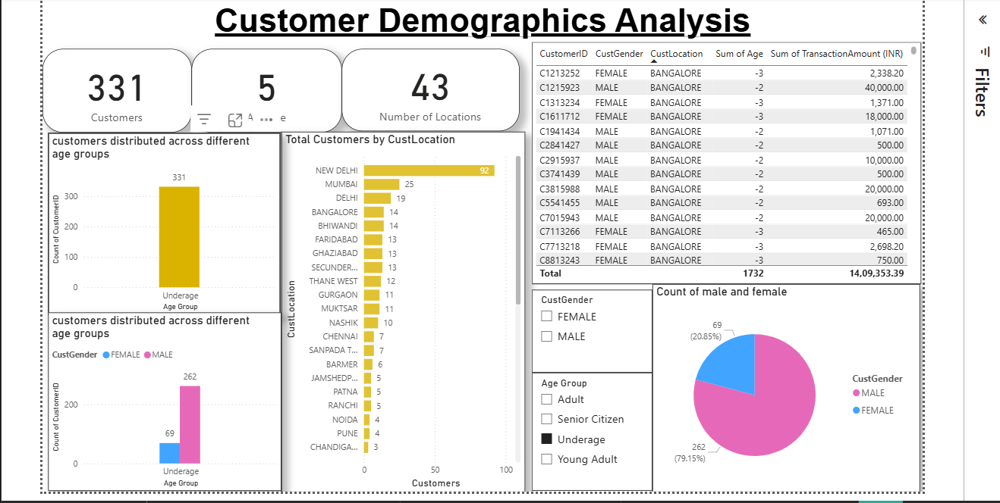
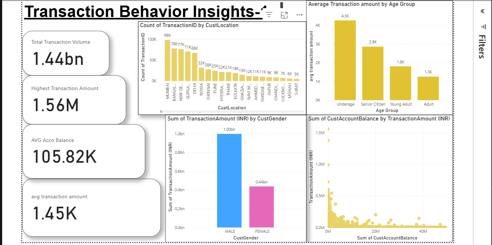
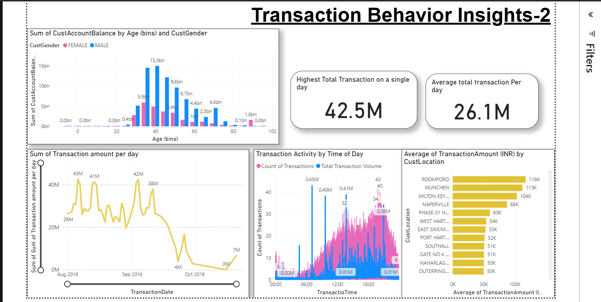

# Bank Customer Segmentation — Power BI Dashboard

## Overview

Analyzed 10,000+ bank customer records to identify 5 distinct behavioral segments using Power BI.

## Key Insights

* Highest single day transaction: 42.5M
* Average daily transaction: 26.1M
* Total transaction volume: 1.44bn
* Male customers dominate transactions (1.00bn vs 0.44bn female)
* New Delhi has highest customer count (92 customers)

## Dashboard Pages

1. Customer Demographics Analysis
2. Transaction Behavior Insights - 1
3. Transaction Behavior Insights - 2

## Tech Stack

Power BI | DAX | Power Query | Excel | Tableau

## Screenshots

## Screenshots

